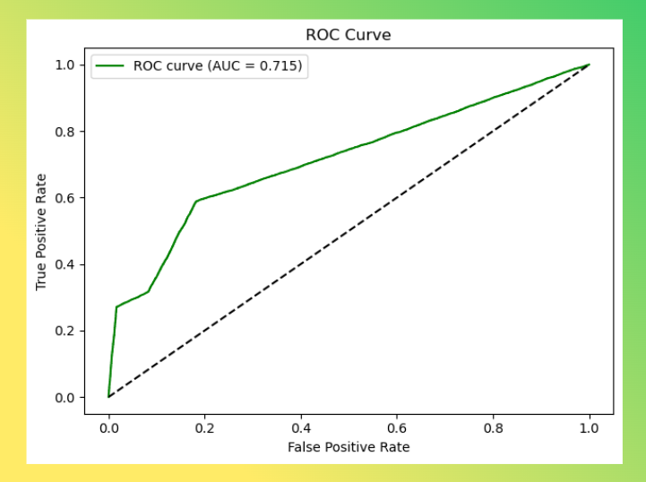
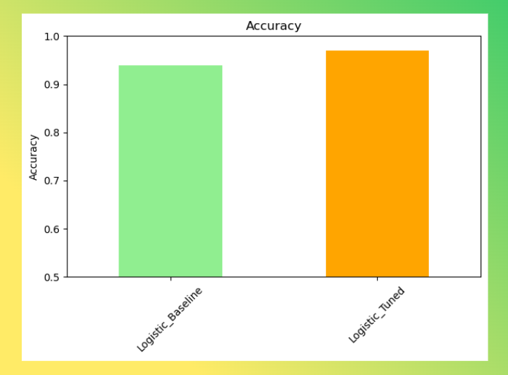

# Smart Supply Chain: Delivery Delay Prediction & Supplier Segmentation

## Project Overview
Machine learning solution for supply chain optimization using DataCo's 180K+ order dataset. Implements logistic regression for delivery delay prediction and multi-class classification for supplier reliability assessment.

## Technical Summary

### Problem 1: Delivery Delay Prediction (Binary Classification)
- **Target**: Late delivery risk 
- **Features**: Shipping mode, customer segment, market, scheduled days, order metrics
- **Model**: Tuned Logistic Regression 
- **Performance**: ROC-AUC 0.756, F1-Score 0.743
- **Key Insight**: Same Day shipping shows 30% delay risk vs 70% for Standard Class

### Problem 2: Supplier Reliability Classification (Multi-class Classification)
- **Target**: Reliability tiers 
- **Features**: Late shipment rate, lead time variability, order volume, profitability
- **Model**: Multinomial Logistic Regression 
- **Performance**: Macro F1-Score 0.890, Accuracy 0.895
- **Key Insight**: Late shipment rate and lead time performance are primary differentiators

## Results & Visualizations
- **ROC Curve Analysis**: Binary classification achieves strong discriminative power (AUC > 0.75)
- **Confusion Matrix**: High precision for both on-time and late delivery predictions
- **Feature Importance**: Shipping mode and geographic location emerge as critical factors
- **Supplier Segmentation**: Clear separation between reliability tiers across performance metrics

## Implementation
- Scikit-learn pipeline with StandardScaler preprocessing
- GridSearchCV hyperparameter optimization
- Real-time scoring capability for new orders and supplier assessment
- Production-ready models for immediate deployment

## Files
- `index.ipynb`: Complete analysis with EDA, modeling, and ROC visualizations
- `DataCoSupplyChainDataset.csv`: Source dataset (180K+ orders)
- `presentation/`: Business presentation materials
